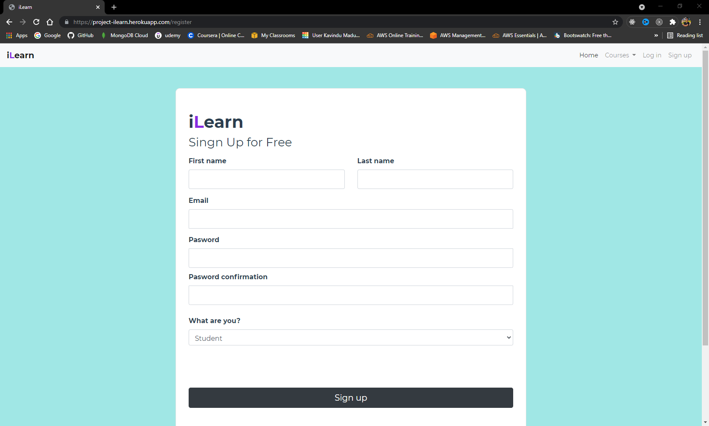
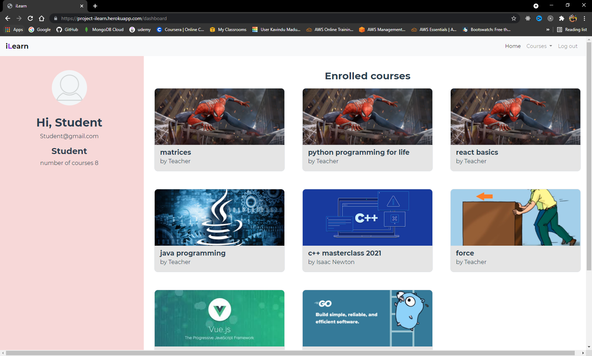
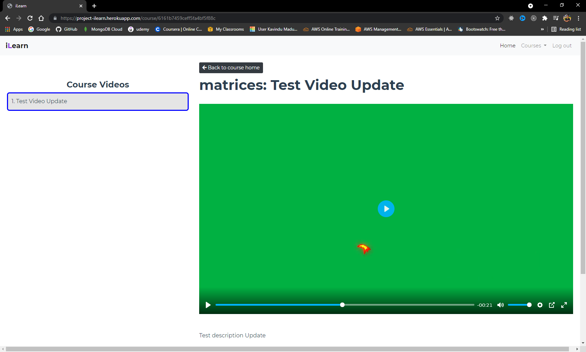
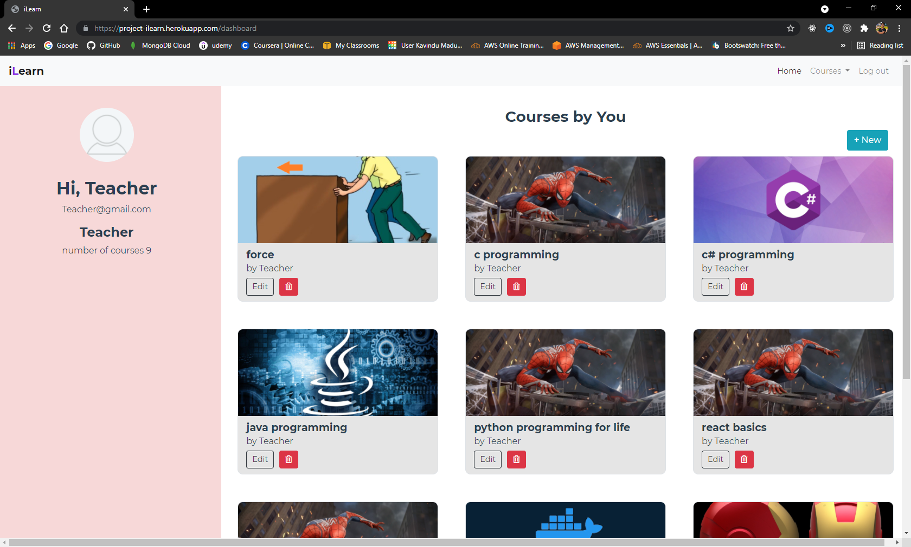
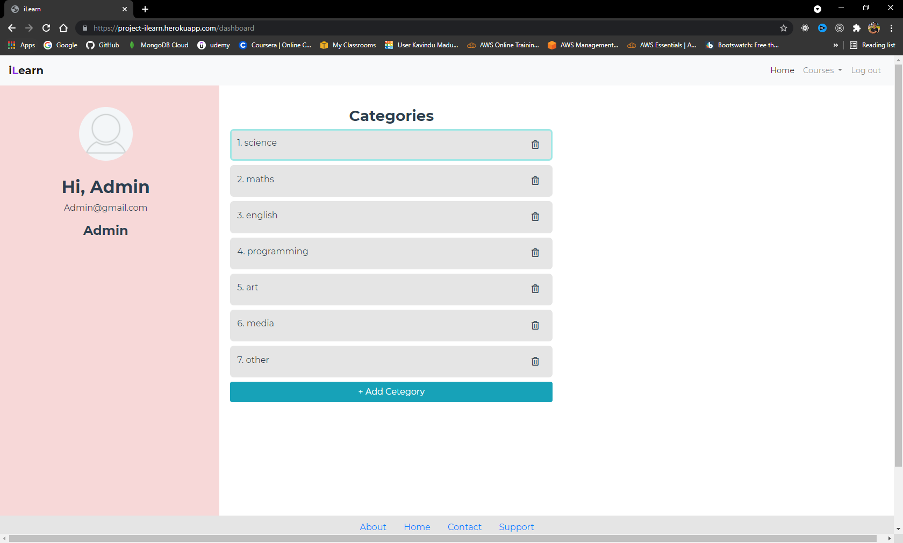

# Online Learning & Teaching Platform

See Live [Click Here](https://project-ilearn.herokuapp.com)

## Project Setup

### Server setup
```
npm install
```

### Run server
```
npm run dev
```

### Client Setup
```
cd client
```

```
npm install
```

### Compiles and hot-reloads for development
```
npm run serve
```

### Compiles and minifies for production
```
npm run build
```

### Screens










